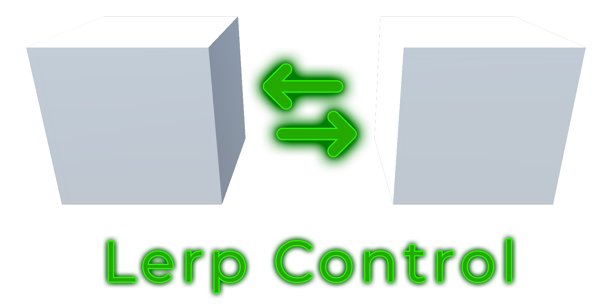
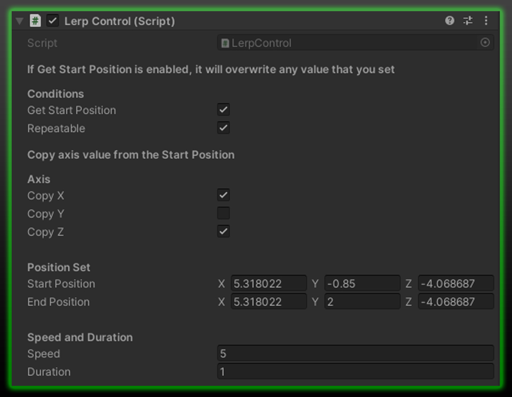

<h3 align="center">Lerp Control For Unity</h3>

<!-- PROJECT LOGO -->

Easily lerp your Gameobjects!

<!-- TABLE OF CONTENTS -->

  
Table of Contents

  <ol>
    <li><a href="#about">About</a></li>
    <li><a href="#functions">Functions</a></li>
    <li><a href="#getting-started">Getting Started</a></li>
    <li><a href="#additional-notes">Additional Notes</a></li>
    <li><a href="#example">Example</a></li>
    <li><a href="#contact">Contact</a></li>
  </ol>

<!-- ABOUT THE PROJECT -->
## About

 
Wanting to move your Gameobjects back and forth easily?
 
This [code](https://github.com/hamdanbasri/LerpControl/blob/main/LerpControl.cs) is here just to do that.

<!-- FUNCTIONS -->
## Functions
* Control the speed and duration of a lerp gameobject.

<!-- GETTING STARTED -->
## Getting Started

* Open Unity and add a <strong>Cube</strong> to the scene.
* Attach the [LerpControl.cs](https://github.com/hamdanbasri/LerpControl/blob/main/LerpControl.cs) script to the <strong>Cube</strong>.
* Specify the Start Position and End Position of your gameobject.
* Set the speed and duration.
* Press <strong>Play</strong> in your editor see the magic of <strong>LerpControl</strong>.

## Additional Notes
* If the current position is your start position, just check the Get Start Position.
* Play around with the Speed and Duration in Play mode.
* Set another cube in the scene to where you want the end position to be, copy the position and paste it in your End Position.

<!-- USAGE EXAMPLES -->
## Example

Quick and easy setup.

 
        <table>
        <tr>
            <td>Variable</td>
            <td>Annotation</td>
            </td>
        <tr>
            <td>Get Start Position</td>
            <td>If enable, the current position of your gameobject will be set to the Start Position.</td>
        </tr>
        <tr>
            <td>Repeatable</td>
            <td>Endless looping of the lerp function.</td>
        </tr>
        <tr>
            <td>Copy X</td>
            <td>Copies the X axis from the Start Position.</td>
        </tr>
        <tr>
            <td>Copy Y</td>
            <td>Copies the X axis from the Start Position.</td>
        </tr>
            <td>Copy Z</td>
            <td>Copies the Z axis from the Start Position.</td>
        </tr>
        <tr>
            <td>Start Position</td>
            <td>Specifies the Start Position in Vector3.</td>
        </tr>
        <tr>
            <td>End Position</td>
            <td>Specifies the End Position in Vector3.</td>
        </tr>
            <td>Speed</td>
            <td>Controls the speed of the lerp.</td>
        </tr>
        <tr>
            <td>Duration</td>
            <td>Controls the duration of the lerp.</td>
        </tr>
        </table>

<!-- CONTACT -->
## Contact

[![LinkedIn][linkedin-shield]][linkedin-url]

(<a href="#readme-top">back to top</a>)

<!-- MARKDOWN LINKS & IMAGES -->
<!-- https://www.markdownguide.org/basic-syntax/#reference-style-links -->
[linkedin-shield]: https://img.shields.io/badge/-LinkedIn-black.svg?style=for-the-badge&logo=linkedin&colorB=555
[linkedin-url]: https://linkedin.com/in/hamdanbasri

